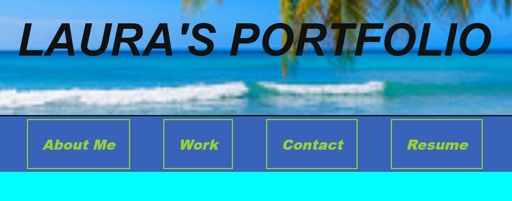
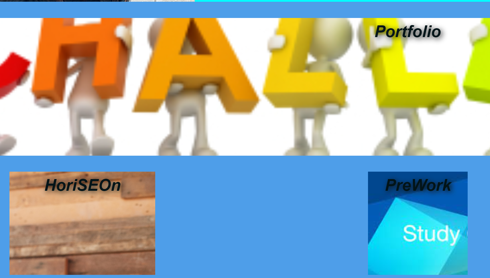
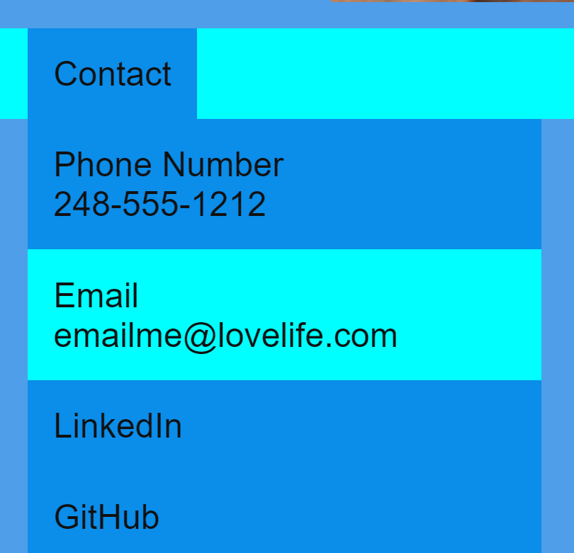

# portfolio-challenge-2

## Description

A electronic version of my resume for you to review and see what work I have accomplished along the way.

## Installation

N/A

## Usage

https://labeutler.github.io/portfolio-challenge-2/

When visiting my page, you can select one of the following tabs and go directly to the location to view more. 

When looking at my "Work", please take the time to click on the links to see more of what I've either devoloped or assisted with developing.

Finally, please use the dropdown for my contact information.  I look forward to hearing from you.

## Credits

N/A

## License

https://choosealicense.com/licenses/mit/
